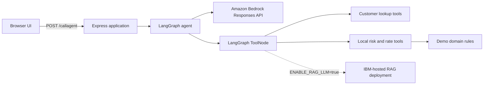

# Architecture and runtime flow

## Overview

The application is a single Node.js process with three runtime boundaries:

1. The browser and Express HTTP server
2. The LangGraph agent and local tools
3. Amazon Bedrock's OpenAI-compatible Responses API

The optional IBM RAG and watsonx Assistant integrations are disabled by default.

## Composition root

[`main.ts`](../main.ts) performs startup only:

1. Loads `.env`.
2. Parses and validates configuration.
3. Optionally renders watsonx Assistant pages.
4. Creates the optional IBM RAG client.
5. Creates LangChain tools and the Bedrock model.
6. Compiles the LangGraph workflow.
7. Creates and starts the Express application.

Business rules and request handling do not live in the entrypoint.

## Agent lifecycle

The graph has three nodes:

- `agent`: sends conversation messages and tool definitions to Bedrock.
- `tools`: executes requested tools through LangGraph's `ToolNode`.
- `finalize`: prevents an identical tool call from looping indefinitely and asks the model to answer from completed tool results.

The graph stops when the latest AI message contains no tool calls. A recursion limit of 12 provides an additional safety boundary.

## Responses API

`ChatOpenAI` is configured with:

- Bedrock's OpenAI-compatible base URL
- `useResponsesApi: true`
- `us.openai.gpt-5.6-luna` by default
- The Bedrock bearer token as the API key

Responses API text blocks are normalized into a string before the HTTP response is returned. Tool-call-only messages therefore have an empty `content` string and retain their `toolCalls`.

## Tool selection

Default mode exposes:

- `get_credit_score`
- `get_account_status`
- `get_overall_risk`
- `get_interest_rate`

When `ENABLE_RAG_LLM=true`, the first two tools remain local while the last two are replaced by:

- `get_overall_risk_from_rag_llm`
- `get_interest_rate_from_rag_llm`

This distinction is validated in `tests/tools.test.js`.

## HTTP boundary

The Express application:

- Serves `public/`
- Limits JSON request bodies to 16 KB
- Validates that `query` is a non-empty string
- Returns a generic 500 response while logging detailed failures server-side

The app factory accepts an injected agent runner, allowing HTTP tests without loading credentials or calling Bedrock.
